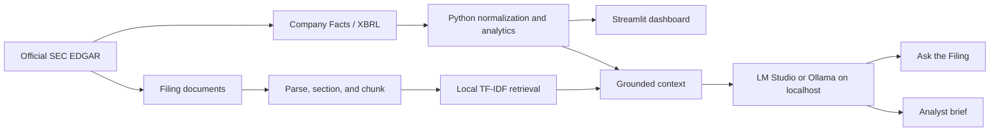
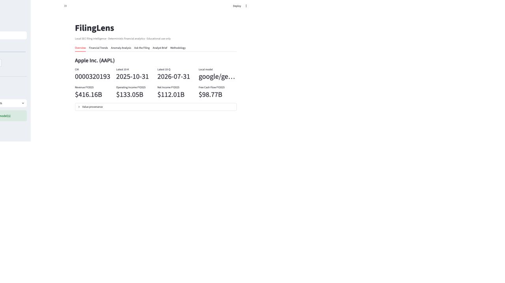
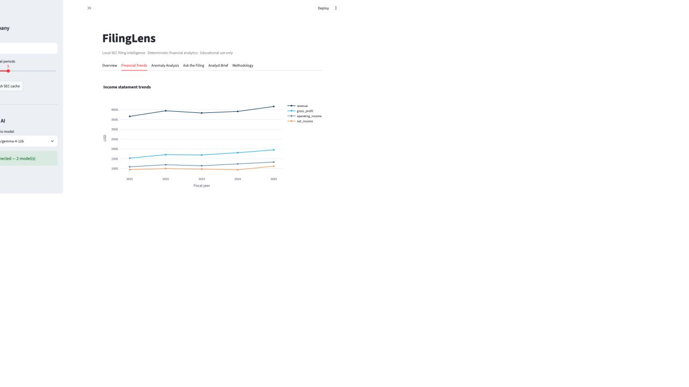

# FilingLens

FilingLens is a local-first Streamlit application that combines official SEC EDGAR data, deterministic Python financial analytics, transparent filing retrieval, and source-grounded language generation through LM Studio or Ollama. It is designed as educational financial-analysis software - not investment advice.

## Project motivation

Financial filings contain both structured accounting data and qualitative management discussion. FilingLens keeps those responsibilities separate: SEC/XBRL supplies traceable facts, Python performs authoritative calculations, and a replaceable local model explains only the verified metrics and retrieved filing passages it receives.

## Key features

- Ticker-to-CIK lookup using the SEC company directory
- Cached and rate-limited access to submissions, Company Facts, and filing documents
- Provenance-rich annual XBRL normalization across candidate US-GAAP concepts
- Income statement, balance sheet, cash-flow, growth, profitability, liquidity, and leverage analysis
- Free cash flow calculated in Python as operating cash flow minus capital expenditures
- Economic year-over-year and median-absolute-deviation anomaly screens
- Optional magnitude-aware anomaly coloring with full, unclipped explanations
- Safe HTML cleanup, best-effort filing section detection, overlapping chunks, and local TF-IDF retrieval
- Automatic LM Studio and Ollama discovery, model selection, grounded Q&A, citations, and analyst brief export
- Graceful no-LLM mode: all deterministic and retrieval features remain usable
- A 20-question evaluation set and optional cross-model benchmark runner

## Architecture



The application has three explicit trust layers:

1. **Data:** official SEC/XBRL observations and filing text with provenance.
2. **Analytics:** deterministic Python statements, ratios, changes, and anomaly scores.
3. **Language:** local-model interpretation of supplied calculations and evidence.

See [docs/architecture.md](docs/architecture.md) for module-level detail.

## Technology stack

Python 3.11+, pandas, NumPy, SciPy, scikit-learn, HTTPX, Beautiful Soup, lxml, Streamlit, Plotly, python-dotenv, pytest, official SEC EDGAR endpoints, and local LM Studio/Ollama APIs.

## Mac quick start

### Prerequisites

- An Apple Silicon Mac running macOS 14 or newer is the recommended setup.
- Python 3.11 or newer. Check with `python3 --version`; install from [python.org](https://www.python.org/downloads/macos/) or Homebrew if needed.
- Internet access for installation and first-time SEC downloads.
- At least 16 GB of memory is recommended for the 12B local-model path. Smaller models can be used on lower-memory systems.

Clone the repository and run the setup helper:

```bash
git clone https://github.com/asapino308/FilingLens.git
cd FilingLens
./scripts/setup_macos.sh
```

The helper creates `.venv`, installs every runtime package declared in `pyproject.toml`, and creates a private `.env` from `.env.example`. For development tools and tests, use `./scripts/setup_macos.sh --dev`.

Open `.env` and replace `your-email@example.com` with a monitored address. The SEC requires an identifiable automated-access User-Agent; the address stays out of Git but is sent to SEC.gov in the HTTP header.

Run the built-in diagnostic before first launch:

```bash
.venv/bin/python scripts/doctor.py
```

Manual installation and troubleshooting are covered in [the Mac setup guide](docs/macos_setup.md) and [the complete user guide](docs/user_guide.md).

## Configuration

`.env` is ignored by Git. Configure it locally:

```dotenv
SEC_USER_AGENT=FilingLens/1.0 your-email@example.com
LOCAL_LLM_PROVIDER=auto
LMSTUDIO_BASE_URL=http://127.0.0.1:1234/v1
LMSTUDIO_MODEL=
LMSTUDIO_API_KEY=
LMSTUDIO_TIMEOUT_SECONDS=300
OLLAMA_BASE_URL=http://127.0.0.1:11434
OLLAMA_MODEL=
OLLAMA_TIMEOUT_SECONDS=300
```

### SEC User-Agent setup

The SEC requests an identifiable automated-access header. Replace the example address with a monitored contact address. FilingLens caps requests at roughly 2.5 per second, retries transient failures with exponential backoff, and caches responses under `data/cache/`.

`LOCAL_LLM_PROVIDER=auto` checks LM Studio first and then Ollama. Set it to `lmstudio` or `ollama` to force one service. Model fields may remain blank so FilingLens can discover available chat models.

### Option A: LM Studio (recommended for a visual Mac workflow)

1. Install [LM Studio](https://lmstudio.ai/download) and open it once.
2. Download and load an instruction-tuned model. On a 16-24 GB Apple Silicon Mac, Gemma 4 12B MLX 5-bit (about 7.7 GB) is a practical starting point; use a smaller model if memory pressure is high.
3. In Developer, start the local server on port `1234`, or run `lms server start` after the LM Studio CLI is initialized.
4. Leave `LMSTUDIO_MODEL` blank to discover exposed chat models, or set an exact ID returned by `GET /v1/models`.

No paid API key is used. `LMSTUDIO_API_KEY` can remain blank when local authentication is disabled.
Keep the server bound to loopback unless you intentionally need network access. Start with a 16K-32K model context rather than the model's maximum theoretical context to control memory use.

Verify LM Studio with:

```bash
curl http://127.0.0.1:1234/v1/models
```

### Option B: Ollama

1. Install [Ollama for macOS](https://ollama.com/download) and open the app.
2. On Apple Silicon, download the comparable MLX model with `ollama run gemma4:12b-mlx`. The portable non-MLX tag is `gemma4:12b`.
3. Exit the first chat with `/bye`; the model remains installed and the local service normally remains available on port `11434`.
4. Set `LOCAL_LLM_PROVIDER=ollama` in `.env`, or leave `auto` if LM Studio is not running.

Verify Ollama with:

```bash
curl http://127.0.0.1:11434/api/tags
```

The deterministic SEC, analytics, charting, anomaly, insider, and retrieval features work when no local model service is running.

## Launch

```bash
.venv/bin/python -m streamlit run app.py
```

Then open `http://localhost:8501`.

## Example workflow

1. Enter `AAPL`, `MSFT`, or another SEC-reporting ticker.
2. Inspect current filing metadata, verified metrics, and XBRL provenance.
3. Review five-year statements, margins, cash flow, liquidity, and leverage.
4. Filter notable or significant unusual-change flags.
5. Load and index the latest 10-K, then ask a filing question.
6. Inspect every retrieved source and its official SEC link.
7. Generate and download a Markdown or HTML analyst brief locally.

Validated example output is summarized in [examples/example_analysis.md](examples/example_analysis.md).

For complete operational documentation, see:

- [Project implementation report](docs/project_report.md)
- [End-user guide and interface reference](docs/user_guide.md)

## Financial data methodology

FilingLens queries:

- `https://www.sec.gov/files/company_tickers.json`
- `https://data.sec.gov/submissions/CIK##########.json`
- `https://data.sec.gov/api/xbrl/companyfacts/CIK##########.json`
- official `https://www.sec.gov/Archives/` filing documents

Annual selection accepts full-year 10-K/10-K/A duration facts (300–450 days) or filing-date instant facts. Observations are grouped by their actual period end—not the later filing's `fy` field—so comparative facts remain in the correct historical period. Explicit concept priority, latest-filed duplicate selection, compatible USD units, and missing-value preservation make the method traceable rather than universal. Every selected value retains ticker, company, CIK, form, accession, dates, metric, unit, and concept.

## XBRL mapping

Candidate mappings cover revenue, cost of revenue, gross profit, operating income, net income, cash, current and total assets, current and total liabilities, equity, long-term debt, operating cash flow, and capital expenditures. Issuer tags vary; FilingLens returns unavailable when no mapped fact meets the annual filters. It does not infer an unverified value.

## Ratio methodology

- Growth = `(current - prior) / abs(prior)`
- Gross / operating / net margin = corresponding profit ÷ revenue
- Return on assets / equity = net income ÷ average beginning-and-ending balance
- Current ratio = current assets ÷ current liabilities
- Debt to assets / equity = long-term debt ÷ assets / equity
- Operating cash flow margin = operating cash flow ÷ revenue
- Free cash flow = operating cash flow − capital expenditures
- Free cash flow margin = free cash flow ÷ revenue

Zero denominators and unavailable inputs remain missing. Negative equity is shown as mathematically calculated and should be interpreted cautiously.

## Anomaly detection

This is an unusual-change screen, not fraud detection. Two methods are combined:

1. **Economic movement:** absolute and percentage year-over-year changes. A movement is Notable at 20% and Significant at 40%.
2. **Robust statistics:** median absolute deviation (MAD) applied to the change series. Absolute robust scores of 2.5 and 3.5 define Notable and Significant. At least four changes are required.

MAD is preferred to an ordinary z-score because short financial histories and a single outlier can distort a mean and standard deviation. Thresholds are screening rules, not evidence of misconduct.

## Retrieval methodology

SEC HTML is cleaned of active elements, segmented using recognized 10-K/10-Q headings with a full-text fallback, and divided into roughly 450-word chunks with overlap. A local scikit-learn TF-IDF index ranks chunks by cosine similarity. The UI exposes scores, passage text, section, filing date, accession, and official source URL.

## Local LLM and numerical grounding

FilingLens discovers exact LM Studio or Ollama model IDs instead of guessing them. Its prompt treats retrieved text as untrusted evidence, requires `[Source N]` citations, refuses unsupported claims, and distinguishes management commentary from Python calculations. Verified metrics are serialized into the model context; the model explains them but is not authoritative for their calculation.

Filing Q&A and the longer analyst brief disable model thinking/reasoning through the selected provider's native local endpoint so output budgets are reserved for visible answers. A conservative deterministic preflight rejects clearly unrelated questions and requests for price predictions or buy/sell advice before model generation. All generation defaults to `127.0.0.1`.

## AI evaluation

`src/filinglens/evaluation/qa_eval.py` contains 20 reusable questions across direct retrieval, MD&A reasoning, risks, metric interpretation, and deliberately unsupported requests. Deterministic checks cover citation presence and insufficient-evidence language. `benchmark.py` can repeat the same questions across selected local models and records model ID, category, answer, citation behavior, latency, and output length.

Current live checks are reported in [docs/evaluation.md](docs/evaluation.md). They are smoke tests, not a statistically conclusive model benchmark.

## Privacy

The finished application contacts SEC.gov for public filings and financial facts. All generative inference goes to the selected loopback LM Studio or Ollama service. FilingLens does not send filing text or user questions to OpenAI, Anthropic, Google, or another cloud LLM API. The local `.env`, SEC cache, model files, and generated reports are excluded from Git. Streamlit usage telemetry is disabled in the committed configuration.

## Testing

```bash
.venv/bin/python -m pytest
```

The unit suite uses fixtures and HTTP mocks rather than repeatedly contacting the SEC, LM Studio, or Ollama. Live integration checks are deliberately separate.

## Limitations

- US-GAAP tag differences and issuer-specific extensions can leave metrics unavailable.
- Period labels use the observation end year; non-calendar retail fiscal years may need issuer-calendar refinement.
- Section extraction is heuristic because SEC HTML varies widely.
- TF-IDF captures lexical relevance, not deep semantic similarity.
- Five annual periods provide limited statistical power; anomaly flags require human context.
- FilingLens does not reconcile every restatement, dimension, acquisition, or segment context.
- Local generation latency depends heavily on model size and hardware.
- Generated explanations may still be incomplete or wrong; inspect cited evidence and verified metrics.

## Responsible use

FilingLens is educational software, not investment advice, an audit, or a fraud-detection system. A flag means a movement crossed a documented screen. Users remain responsible for reading the filing, validating accounting comparability, and making independent decisions.

## Future improvements

The highest-value next improvement is an issuer-aware fiscal calendar and XBRL reconciliation layer that can distinguish total debt components, restated contexts, and fiscal-year labels across non-calendar filers. After that, risk-factor change comparison and locally hosted semantic embeddings would be useful extensions.

## Interface preview

The Streamlit interface provides seven tabs—Overview, Financial Trends, Anomaly Analysis, Insider Activity, Ask the Filing, Analyst Brief, and Methodology—with provenance tables, official Form 4 ownership transactions, and expandable filing evidence.




