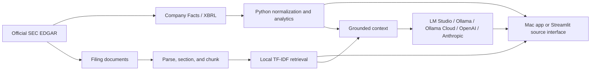

# FilingLens

FilingLens is a local-first Mac research app that combines official SEC EDGAR data, deterministic Python financial analytics, transparent filing retrieval, and source-grounded language generation through LM Studio, local Ollama, Ollama Cloud, OpenAI, or Anthropic. The original Streamlit interface remains available as a fallback. FilingLens is educational financial-analysis software, not investment advice.

## Download the Mac app

Download the current [FilingLens 0.2.0 preview](https://github.com/asapino308/FilingLens/releases/tag/v0.2.0) for Apple Silicon (M-series) Macs running macOS 14 or newer. The download includes its own Python service; users do not need to install Python, Node, or Rust. Follow the [Mac download and first-launch instructions](docs/desktop_app.md#download-and-open-the-mac-app) before opening it.

**Current release:** the app has an ad hoc code signature but has not been verified or notarized by Apple. macOS may warn when it is downloaded. The guide explains Apple's **Open Anyway** flow. Only allow the app after downloading it from this repository's release page; do not bypass a warning that says the app contains malware or has been damaged.

FilingLens starts a private Python service automatically and keeps the SEC cache under `~/Library/Application Support/FilingLens/cache`. A fresh download contains no user's settings, SEC cache, or AI key. On first launch, enter your own SEC contact in Settings; optional cloud AI keys are stored in macOS Keychain. Your later research and preferences stay on your device. First startup can take several seconds while the service starts. SEC data does not require an API key.

The [desktop user guide](docs/desktop_app.md) explains every workspace area. A local AI server must be running if you choose LM Studio or local Ollama; SEC research and calculated financial analysis work without AI. Source setup is below for developers.

## Project motivation

Financial filings contain both structured accounting data and qualitative management discussion. FilingLens keeps those responsibilities separate: SEC/XBRL supplies traceable facts, Python performs authoritative calculations, and a replaceable AI provider explains only the verified metrics and retrieved filing passages it receives.

## Key features

- Ticker-to-CIK lookup using the SEC company directory
- Cached and rate-limited access to submissions, Company Facts, and filing documents
- Provenance-rich annual XBRL normalization across candidate US-GAAP concepts
- Income statement, balance sheet, cash-flow, growth, profitability, liquidity, and leverage analysis
- Free cash flow calculated in Python as operating cash flow minus capital expenditures
- Economic year-over-year and median-absolute-deviation anomaly screens
- Optional magnitude-aware anomaly coloring with full, unclipped explanations
- Safe HTML cleanup, best-effort filing section detection, overlapping chunks, and local TF-IDF retrieval
- Optional LM Studio, local Ollama, Ollama Cloud, OpenAI, and Anthropic connections for grounded Q&A, citations, and analyst brief export
- Expanded Overview with year-over-year deltas, ratio snapshot, direct filing links, latest anomaly counts, and general company Q&A
- Local research approaches (Explore, Evaluate, Follow), saved companies, guided filing questions, and a source-linked comparison with the last company check
- Latest 10-Q reading and grounded Q&A, a separate quarterly financial snapshot, and analyst briefs citing both recent 10-K and 10-Q evidence when available
- Graceful no-LLM mode: all deterministic and retrieval features remain usable
- A 20-question evaluation set and optional cross-model benchmark runner

## Architecture



The application has three explicit trust layers:

1. **Data:** official SEC/XBRL observations and filing text with provenance.
2. **Analytics:** deterministic Python statements, ratios, changes, and anomaly scores.
3. **Language:** provider-selected interpretation of supplied calculations and evidence.

See [docs/architecture.md](docs/architecture.md) for module-level detail.

## Technology stack

Python 3.11+, pandas, NumPy, HTTPX, Beautiful Soup, lxml, Streamlit, Plotly, FastAPI, Tauri, React, python-dotenv, pytest, official SEC EDGAR endpoints, and optional AI provider APIs.

## Run from source (Streamlit)

The following setup, `.env` file, sidebar controls, and `localhost:8501` address apply to the source interface. People using the downloaded Mac app should use its **Settings** screen and the [desktop user guide](docs/desktop_app.md) instead.

### Prerequisites

- An Apple Silicon Mac running macOS 14 or newer is the recommended setup.
- Python 3.11 or newer. Check with `python3 --version`; install from [python.org](https://www.python.org/downloads/macos/) or Homebrew if needed.
- Internet access for installation and first-time SEC downloads.
- Local AI memory needs depend on the model you choose; SEC research works without a local model.

Clone the repository and run the setup helper:

```bash
git clone https://github.com/asapino308/FilingLens.git
cd FilingLens
./scripts/setup_macos.sh
```

The helper creates `.venv`, installs every runtime package declared in `pyproject.toml`, and creates a private `.env` from `.env.example`. For development tools and tests, use `./scripts/setup_macos.sh --dev`.

Open `.env` and replace `your-email@example.com` with a monitored address. The SEC requires an identifiable automated-access User-Agent; the address stays out of Git but is sent to SEC.gov in the HTTP header.

Run the built-in diagnostic before first launch:

```bash
.venv/bin/python scripts/doctor.py
```

Manual installation and troubleshooting are covered in [the Mac setup guide](docs/macos_setup.md) and [the complete user guide](docs/user_guide.md).

## Source configuration

`.env` is ignored by Git. Configure it locally:

```dotenv
SEC_USER_AGENT=FilingLens/1.0 your-email@example.com
AI_PROVIDER=auto
LMSTUDIO_BASE_URL=http://127.0.0.1:1234/v1
LMSTUDIO_MODEL=
LMSTUDIO_API_KEY=
LMSTUDIO_TIMEOUT_SECONDS=300
OLLAMA_BASE_URL=http://127.0.0.1:11434
OLLAMA_MODEL=
OLLAMA_TIMEOUT_SECONDS=300
OLLAMA_API_KEY=
OLLAMA_CLOUD_BASE_URL=https://ollama.com
OLLAMA_CLOUD_MODEL=
OLLAMA_CLOUD_TIMEOUT_SECONDS=300
OPENAI_API_KEY=
OPENAI_MODEL=
ANTHROPIC_API_KEY=
ANTHROPIC_MODEL=
```

### SEC User-Agent setup

The SEC requests an identifiable automated-access header. Replace the example address with a monitored contact address. FilingLens caps requests at roughly 2.5 per second and retries transient failures with exponential backoff. The source interface caches responses under `data/cache/`; the downloaded Mac app uses `~/Library/Application Support/FilingLens/cache`.

`AI_PROVIDER=auto` checks LM Studio, local Ollama, Ollama Cloud, OpenAI, and Anthropic. Set it to `lmstudio`, `ollama`, `ollama_cloud`, `openai`, or `anthropic` to force one service. Model fields may remain blank so FilingLens can discover available text models. The older `LOCAL_LLM_PROVIDER` variable remains accepted for backward compatibility.

### Option A: LM Studio (recommended for a visual Mac workflow)

1. Install [LM Studio](https://lmstudio.ai/download) and open it once.
2. Download and load an instruction-tuned model that fits your Mac's available memory.
3. In Developer, start the local server on port `1234`, or run `lms server start` after the LM Studio CLI is initialized.
4. Leave `LMSTUDIO_MODEL` blank to discover exposed chat models, or set an exact ID returned by `GET /v1/models`.

No paid API key is used. `LMSTUDIO_API_KEY` can remain blank when local authentication is disabled.
Keep the server bound to loopback unless you intentionally need network access. Start with a 16K-32K model context rather than the model's maximum theoretical context to control memory use.

Verify LM Studio with:

```bash
curl http://127.0.0.1:1234/v1/models
```

### Option B: Ollama

1. Install [Ollama for macOS](https://ollama.com/download) and open the app.
2. Download a model supported by your Mac using Ollama's current model library and start it with `ollama run <model-name>`.
3. Exit the first chat with `/bye`; the model remains installed and the local service normally remains available on port `11434`.
4. Set `AI_PROVIDER=ollama` in `.env`, or leave `auto` if LM Studio is not running.

Verify Ollama with:

```bash
curl http://127.0.0.1:11434/api/tags
```

The deterministic SEC, analytics, charting, anomaly, insider, and retrieval features work when no AI provider is available.

### Option C: Ollama Cloud API

1. Create an API key in [Ollama API key settings](https://ollama.com/settings/keys).
2. In the downloaded Mac app, open **Settings** and save the key in macOS Keychain. In the Streamlit source interface, expand **Add Ollama Cloud API key** in the sidebar.
3. In Streamlit, paste the key and choose **Connect for this session** or **Save on this Mac**. The latter writes it to the Git-ignored `.env` with owner-only permissions.
4. Select **Ollama Cloud** and an available model. FilingLens discovers models from `https://ollama.com/api/tags`.

Advanced users may instead place the key in `.env` as `OLLAMA_API_KEY=...`. Set `AI_PROVIDER=ollama_cloud` to force cloud mode, or leave `auto` to keep every detected provider selectable.

Ollama Cloud receives the question, verified metrics, and retrieved SEC filing passages used in a request. The key is sent only in the Bearer authorization header and is never displayed by FilingLens. Cloud usage may consume plan credits.

The model list is discovered from your provider account. FilingLens may initially show models identified by its current free-credit filter; check Ollama's current terms and your account before running a cloud model. A separate control reveals additional models that may require paid credits. If Ollama rejects a request for insufficient credits, FilingLens offers model or account-credit options.

### Option D: OpenAI or Anthropic API

In the Mac app, open **Settings**, paste an OpenAI or Anthropic API key, and save. Keys are stored in macOS Keychain. Select the provider and an available model. In the Streamlit interface, expand **Add OpenAI API key** or **Add Anthropic API key**; you can connect for the current session or save to the Git-ignored `.env` file. Advanced users can set `OPENAI_API_KEY` or `ANTHROPIC_API_KEY` directly, with optional `OPENAI_MODEL` or `ANTHROPIC_MODEL` defaults. These direct APIs may incur provider charges. The selected provider receives the question, verified metrics, and retrieved filing passages.

## Launch the Streamlit source interface

```bash
.venv/bin/python -m streamlit run app.py
```

Then open `http://localhost:8501`.

## Example workflow

1. Enter `AAPL`, `MSFT`, or another SEC-reporting ticker.
2. Inspect filing metadata, year-over-year deltas, the ratio snapshot, and latest anomaly counts on Overview.
3. Review five-year statements, margins, cash flow, liquidity, and leverage.
4. Filter notable or significant unusual-change flags.
5. Ask a grounded general company question on Overview or load the latest 10-K in Ask the Filing.
6. Inspect every retrieved source and its official SEC link.
7. Generate and download an analyst brief. The Mac app exports Markdown; the Streamlit source interface also offers HTML.

Validated example output is summarized in [examples/example_analysis.md](examples/example_analysis.md).

For complete operational documentation, see:

- [Desktop app guide](docs/desktop_app.md)
- [End-user guide and interface reference](docs/user_guide.md)

## Financial data methodology

FilingLens queries:

- `https://www.sec.gov/files/company_tickers.json`
- `https://data.sec.gov/submissions/CIK##########.json`
- `https://data.sec.gov/api/xbrl/companyfacts/CIK##########.json`
- official `https://www.sec.gov/Archives/` filing documents

Annual selection accepts full-year 10-K/10-K/A duration facts (300–450 days) or filing-date instant facts. Observations are grouped by their actual period end—not the later filing's `fy` field—so comparative facts remain in the correct historical period. Explicit concept priority, latest-filed duplicate selection, compatible USD units, and missing-value preservation make the method traceable rather than universal. Every selected value retains ticker, company, CIK, form, accession, dates, metric, unit, and concept.

## XBRL mapping

Candidate mappings cover revenue, cost of revenue, gross profit, operating income, net income, cash, current and total assets, current and total liabilities, equity, long-term debt, operating cash flow, and capital expenditures. Issuer tags vary; FilingLens returns unavailable when no mapped fact meets the annual filters. It does not infer an unverified value.

## Ratio methodology

- Growth = `(current - prior) / abs(prior)`
- Gross / operating / net margin = corresponding profit ÷ revenue
- Return on assets / equity = net income ÷ average beginning-and-ending balance
- Current ratio = current assets ÷ current liabilities
- Debt to assets / equity = long-term debt ÷ assets / equity
- Operating cash flow margin = operating cash flow ÷ revenue
- Free cash flow = operating cash flow − capital expenditures
- Free cash flow margin = free cash flow ÷ revenue

Zero denominators and unavailable inputs remain missing. Negative equity is shown as mathematically calculated and should be interpreted cautiously.

## Anomaly detection

This is an unusual-change screen, not fraud detection. Two methods are combined:

1. **Economic movement:** absolute and percentage year-over-year changes. A movement is Notable at 20% and Significant at 40%.
2. **Robust statistics:** median absolute deviation (MAD) applied to the change series. Absolute robust scores of 2.5 and 3.5 define Notable and Significant. At least four changes are required.

MAD is preferred to an ordinary z-score because short financial histories and a single outlier can distort a mean and standard deviation. Thresholds are screening rules, not evidence of misconduct.

## Retrieval methodology

SEC HTML is cleaned of active elements, segmented using recognized 10-K/10-Q headings with a full-text fallback, and divided into roughly 450-word chunks with overlap. A lightweight local TF-IDF index ranks chunks by cosine similarity. The UI exposes scores, passage text, section, filing date, accession, and official source URL.

## AI providers and numerical grounding

FilingLens discovers exact model IDs from the selected provider instead of guessing them. Its prompt treats retrieved text as untrusted evidence, requires `[Source N]` citations, refuses unsupported claims, and distinguishes management commentary from Python calculations. Verified metrics are serialized into the model context; the model explains them but is not authoritative for their calculation.

Filing Q&A, Overview Q&A, and the longer analyst brief disable model thinking/reasoning where supported so output budgets are reserved for visible answers. A conservative deterministic preflight rejects clearly unrelated questions and requests for price predictions or buy/sell advice before model generation. Local providers use loopback endpoints; Ollama Cloud uses the authenticated `https://ollama.com/api` endpoint.

## AI evaluation

`src/filinglens/evaluation/qa_eval.py` contains 20 reusable questions across direct retrieval, MD&A reasoning, risks, metric interpretation, and deliberately unsupported requests. Deterministic checks cover citation presence and insufficient-evidence language. `benchmark.py` can repeat the same questions across selected models and records model ID, category, answer, citation behavior, latency, and output length.

Earlier live checks are reported in [docs/evaluation.md](docs/evaluation.md). They are smoke tests, not a statistically conclusive model benchmark.

## Privacy

The application contacts SEC.gov for public filings and financial facts. Local inference stays on the selected loopback LM Studio or Ollama service. When a cloud provider is selected, FilingLens sends the question, verified metrics, and retrieved filing passages to that provider's authenticated API. The local `.env`, SEC cache, model files, and generated reports are excluded from Git. Streamlit usage telemetry is disabled in the committed configuration.

## Testing

```bash
.venv/bin/python -m pytest
```

The unit suite uses fixtures and HTTP mocks rather than repeatedly contacting the SEC, LM Studio, or Ollama. Live integration checks are deliberately separate.

## Limitations

- US-GAAP tag differences and issuer-specific extensions can leave metrics unavailable.
- Period labels use the observation end year; non-calendar retail fiscal years may need issuer-calendar refinement.
- Section extraction is heuristic because SEC HTML varies widely.
- TF-IDF captures lexical relevance, not deep semantic similarity.
- Short annual histories provide limited statistical power; anomaly flags require human context.
- FilingLens does not reconcile every restatement, dimension, acquisition, or segment context.
- Local generation latency depends heavily on model size and hardware.
- Generated explanations may still be incomplete or wrong; inspect cited evidence and verified metrics.

## Responsible use

FilingLens is educational software, not investment advice, an audit, or a fraud-detection system. A flag means a movement crossed a documented screen. Users remain responsible for reading the filing, validating accounting comparability, and making independent decisions.

## Future improvements

The highest-value next improvement is an issuer-aware fiscal calendar and XBRL reconciliation layer that can distinguish total debt components, restated contexts, and fiscal-year labels across non-calendar filers. After that, risk-factor change comparison and locally hosted semantic embeddings would be useful extensions.

## Interface preview

The Streamlit interface provides seven tabs—Overview, Financial Trends, Anomaly Analysis, Insider Activity, Ask the Filing, Analyst Brief, and Methodology—with provenance tables, official Form 4 ownership transactions, and expandable filing evidence.


